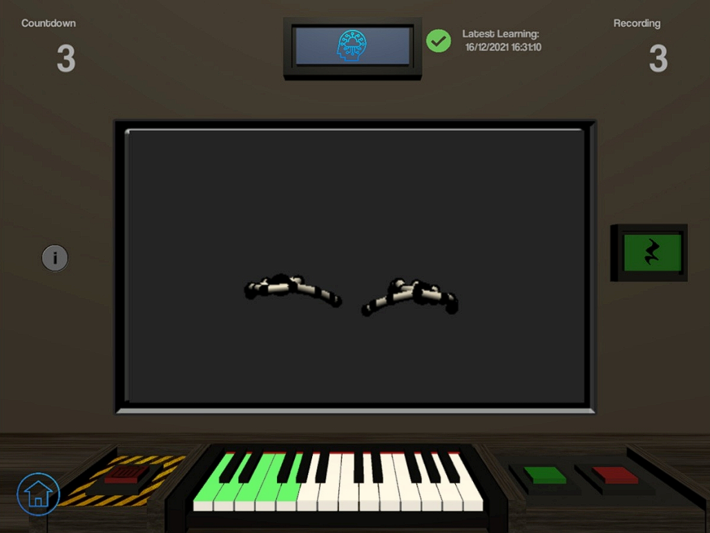
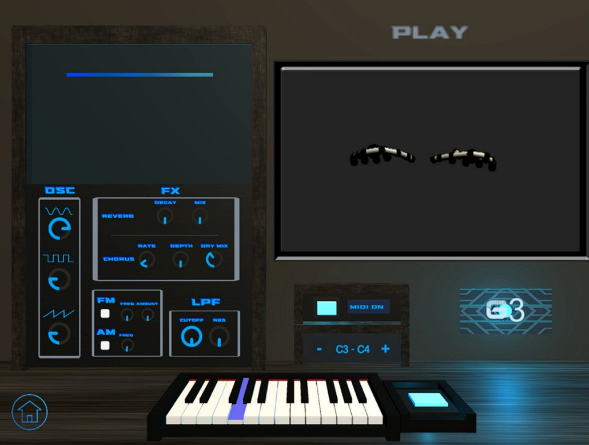
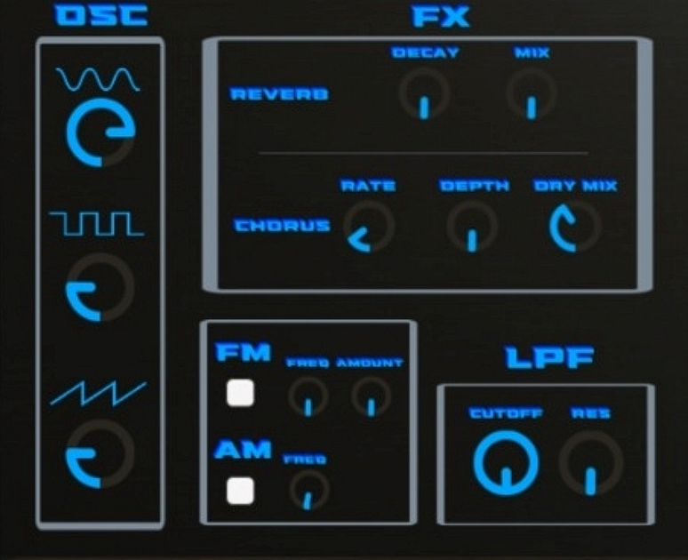

# MarcoSmiles v5.0 :musical_keyboard: :saxophone:
MarcoSmiles is a project born in 2016 within the Musimathics Laboratory of the University of Salerno that aims to realise new Human-Computer Interaction techniques for musical performances.
It offers the ability to fully customize the way a virtual musical instrument is played with only basic hand movements. It uses a Leap Motion Controller to track the user's hand position and a suitably trained artificial neural network (ANN) to link that position to a note in real time.
It also features a MIDI management module that ensures MarcoSmiles can be used with any device with a midi interface.

  
*New features compared to version 4.0:*
- *Possibility to use the system (Play phase only) with a Mini PC Windows. This function allows you to use it without the need for a computer, thus guaranteeing portability. At the moment it's possible only to use a single Leap Motion configuration.*
- *Fix bugs*.

## Prerequisites
On the Windows computer:
- Python 3.9.13;
  - numpy 1.24.3;
  - pandas 2.0.2;
  - scikit-learn 1.2.2;
  - matplotlib 3.7.1;
- [LeapMotion SDK v5.12](https://developer.leapmotion.com/tracking-software-download);
- [LoopMidi](https://www.tobias-erichsen.de/software/loopmidi.html). Create a virtual MIDI port with the name `MarcoSmiles` (it's essential to give this name to the port in order to give the possibility to the MIDI management module to find this virtual MIDI port).

You also need to use a Windows Mini PC. If you do not have one already configured, follow the guide in the `MarcoSmilesPortable` folder.
## Use it
### MarcoSmiles 5.0
MarcoSmiles 5.0 is a desktop application with a graphical user interface. Make sure you have connected leap motions before starting the system.
#### Main Scene
The Main Scene is the home page of the system. At the top is the logo of MarcoSmiles and below it the various buttons that allow you to navigate the different screens of the system. It will not be possible to access the Play Scene (Play Scene) without having previously trained the system.
At the bottom there is a section that provides access to functions related to the system configurations, which, through buttons, allows you to change, import and export configurations previously made by the user.
#### Train Scene
The training scene is dedicated to training the neural network. The user can associate each note with the hand configuration he or she most
desires. The middle section is dedicated to the projection of the hands in real
time detected by the Leap Motion Controller. On the right side of the screen is
present a button with a semiquaver pause icon whose function
is to train the system to "play" a pause. On the left instead is
present the info button, which, when clicked, shows instructions
for training the system. At the bottom of the GUI is
present a virtual piano, consisting of two octaves, which allows you to select the note to be trained. The user, through a click on the key of the
piano, decides to train the system on that note which will assume a blue color, so as to visually communicate the choice made. To the right
of the piano there are two different colored buttons:
- the green one starts recording the hand configuration
- the red one deletes the last configuration acquired

To the left of the piano are two buttons that allow you to respectively return to the Main Scene, and to delete all configurations
of the hands recorded within the current system. Centrally in the top of the interface is a blue button that has the function of starting the Python script, which will finalize the training.

The training process consists of several steps:
1. Select, on the virtual piano, the note that you wish to train (or pause with the corresponding button);

2. Press the green button, which starts a 3 second countdown in which you must assume the configuration of the hands you want to associate with the selected note;
3. At the end of the countdown, the system will start the actual recording of the position of the hands; in this phase 500 measurements will be taken, for a total of about 3 minutes of training (you will be able to see the progress of this operation in the upper right corner, where the relevant counter is);
4. When the process is finished, the note will turn green to indicate that training has been carried out for the latter.
   
It is possible to perform multiple trainings for the same note. In case you are not satisfied with the newly registered configuration you can delete it using the red button. When you have registered the various desired positions, press the training button, thus proceeding with the creation of a configuration of the newly trained system. This operation will bring into execution the python script for Machine Learning, which will take time proportional to the computational resources of the machine on which it is running and the size of the dataset. At the end of the execution of the script, the system will allow you to access the execution scene (Play Scene) and use, therefore, the configuration just created. At last, at the top, the outcome of the learning with its termination time will be indicated.

#### Play Scene
The Play Scene enables musical performances using the selected system configuration. As in the Training Scene, it is possible to view the user's hands in real-time. At the bottom of the scene there is a virtual piano, the keys of which are highlighted in blue and their pressure is simulated when the user assumes a hand configuration that the system can recognize. There are two buttons that allow the user to vary the range of octaves. The default option uses octaves C3-C4, and the buttons allow increasing or decreasing that range, respectively. There is also a button to enable/disable the MIDI feature, which, when activated, will mute the synthesizer and the button will emit a blue light. Next to the piano there is an additional button that allows you to activate/deactivate a "hologram" which allows you to visualize the notes that are being played.

Next to the window in which the hands are displayed is the section dedicated to controlling the parameters of the Virtual Synth, which has the characteristic of being totally customizable, and thus allows the timbre of the sound to be changed and modulations, filters and effects to be added. Thanks to a graphical interface based on Knobs, which attempt to simulate the potentiometers of a real synthesizer, the you will be able to vary the parameters of the Synth.

### Export dataset

To export a dataset u need to navigate to the main menu page and press "_export dataset_". At this point select the desired dataset and save it. Then you can use it into MarcoSmiles5.0 or into MarcoSmiles Portable.

#### Import in MarcoSmiles5.0
Navigate to the main scene and select import dataset. Choose the dataset you wish to import and confirm. (_You can check the dataset you are using on the main page_)

#### Import in MarcoSmiles Portable 
Access the utils folder and copy and paste the dataset you want to use. This must be done before using MarcoSmiles Portable so that the dataset can be processed by the system.

## Developed by
[Salerno Daniele](https://github.com/DanieleSalerno) 
[Simone Benedetto](https://github.com/BenedettoSimone)
